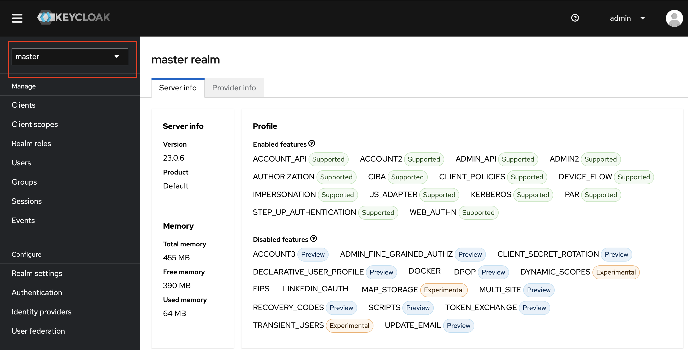
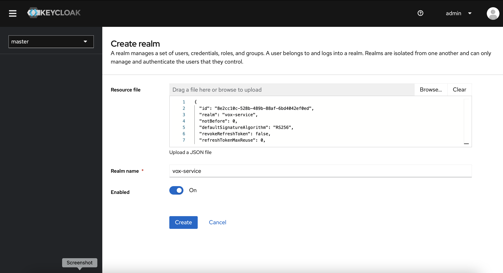
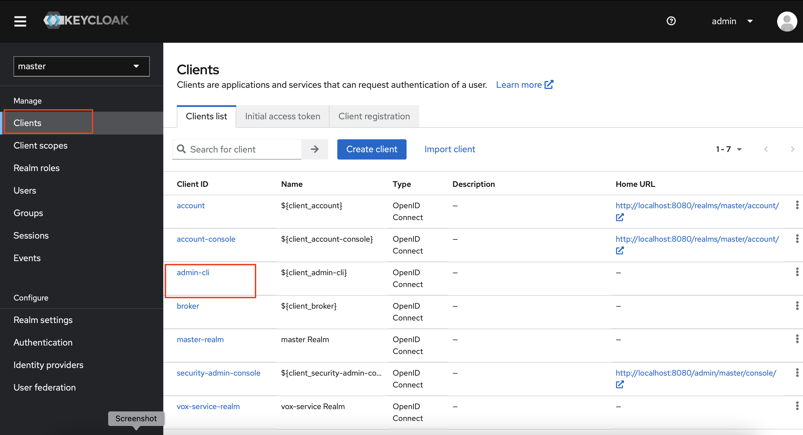
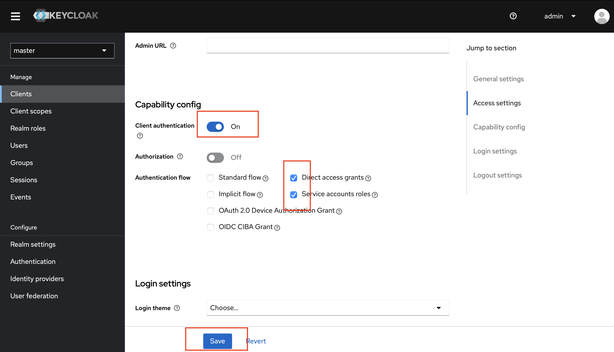
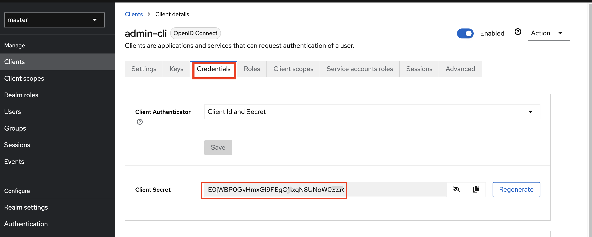
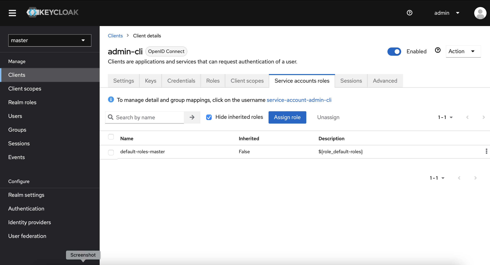
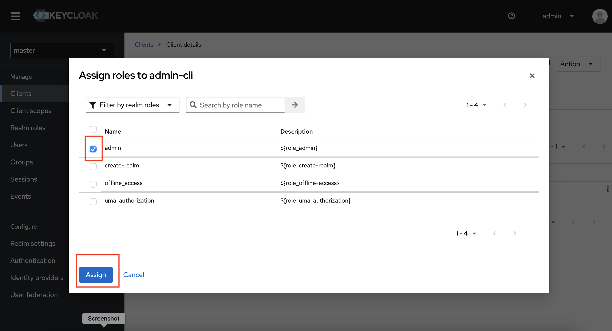

# Vox-Authentication-Service

### **Prerequisite**
Ensure this; https://github.com/vox-technologies/Vox-Postgresql-Service is already setup and running.

### VARIABLES
The file `.env-example` contains all the dynamic variables.
Create yours as `cp .env-example .env` and alter your variables to taste.

### Initializing the Keycloak Container:
This command will spin up the containers in the background (-d flag) according to the configuration specified in the docker-compose.yml file.

```docker
docker-compose up -d
```
### **API Documentation**

URL: https://github.com/vox-technologies/vox-authentication-service/blob/master/Documentation/Keycloak%20API%20Documentation%201763a831ed4e4a4f8745a9c6052c576f-3.md


### Configuring Keycloak

1. Once Keycloak is up and running, you can log into the admin console using the provided [localhost](http://localhost/) link. Sign into the Keycloak Admin Console with the Temp. login (user=> admin; pswd: admin)
2. You would be presented with the main `master` realms as show in the images below;



3. click in the drop-down where the master realm is highlighted in the image and click on `Create realm`
4. In the "Create Realm" section, upload the `realm-export.json` configuration file as shown below. This .json file is located in the config folder of the main package, :



5. A new realm called vox-service is created within  and all the configuration updated.
6. Next, is to go to the same drop-down tab and click on Master realm, In the master’s realm main menu, click on the clients and admin-cli as shown below;



7. You would be taken into the admin-cli settings, scroll down to the Access Settings and enable the configurations as show in the image below and save;



8. After saving the configuration, a new "Credentials" tab appears. This is necessary for setting up the admin access token used to create the user API endpoint, as shown in the image below.



9. Next, go to the service account roles tab and click on Assign role button ;



10. IIn the "Assign Role" section, as shown in the image below, check the "Admin" box and save the changes.



and Wahla!  , Keyclolak is ready for use.

# Note:

1. Check the Documentation folder on the main directory of this package for the API Documentations
2. Also, This .json Configuration file are located in the folder Config.

Thank You.
